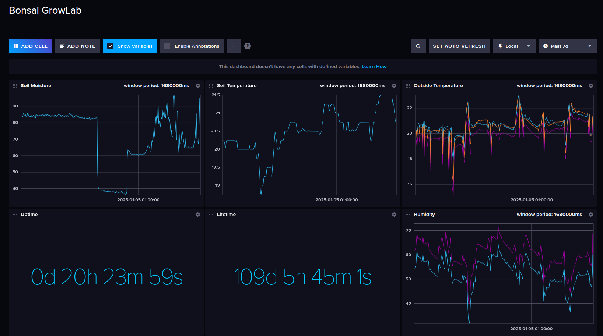

## Introduction

This guide shows how to set up the device-hub on the Raspberry Pi and monitor data from the IoT devices using the InfluxDB database.

## Install Raspberry Pi OS

Install the Raspberry Pi OS using the [Raspberry Pi Imager](https://www.raspberrypi.com/software/). It's possible to use any Linux-based operating system, see the [Getting Started Guide](https://www.raspberrypi.com/documentation/computers/getting-started.html). The following instructions use Raspberry Pi OS Lite 64-bit. During the installation, make sure that SSH is enabled and the "Allow public-key authentication only" option is set. This will be needed later to set up the system. Next, make sure the wireless LAN is configured with the router's SSID and password, or it can be skipped if the Ethernet connection is to be used. Once the operating system has been installed, you'll need to connect to the RPi to perform the necessary settings.

For the RPi 4 it's recommended to update the bootloader right after the OS is installed. This can be done with the following command:

```bash
sudo rpi-eeprom-update
sudo reboot
```

Once the OS is installed, switch on the RPi and check that mDNS is working properly:

```bash
# Replace `device-hub-rpi` with configured hostname.
ping device-hub-rpi.local
```

The result can be as follows:

```
64 bytes from 192.168.1.169 (192.168.1.169): icmp_seq=1 ttl=64 time=8.86 ms
64 bytes from 192.168.1.169 (192.168.1.169): icmp_seq=2 ttl=64 time=8.50 ms
64 bytes from 192.168.1.169 (192.168.1.169): icmp_seq=3 ttl=64 time=12.4 ms
```

For some reason my RPi won't boot unless I connect it to the external display. The first time it is connected to the display, it boots normally and I can continue to use it without any problems.

If the RPi is working normally, it's time to connect to it via SSH and set up the device-hub.

## Install System Software

During the OS installation it was required to enable SSH. Now it's time to add a private key to the ssh agent, so that it will be possible to connect to the RPi without manually specifying the path to the private key:

```bash
# Replace with the corresponding path to the private SSH key.
ssh-add ~/.ssh/rpi3b
```

Now it should be possible to connect to the RPi as follows:

```bash
# Replace dshil with the configured user name
# Replace device-hub-rpi with the configured hostname
ssh dshil@device-hub-rpi.local
```

Now it's time to install the required packages.

**Install Docker**

```bash
# See also the official instruction: https://docs.docker.com/engine/install/debian/
curl -sSL https://get.docker.com | sh
sudo usermod -aG docker $(whoami)
sudo reboot
```

**Install git**

```bash
sudo apt-get install git
```

## Install Device-Hub Software

**Clone device-hub repository**

```bash
git clone https://github.com/open-control-systems/device-hub.git
```

**Configure influxdb service**

See the following [guide](../../influxdb.md).

**Run influxdb service**

```bash
# Replace <username>, <password>, <admin>, <bucket>, <org> with the required credentials.
# See also https://docs.influxdata.com/influxdb/cloud/reference/key-concepts/data-elements/.
cd device-hub/projects/main
DEVICE_HUB_STORAGE_INFLUXDB_USERNAME="<username>" \
DEVICE_HUB_STORAGE_INFLUXDB_PASSWORD="<password>" \
DEVICE_HUB_STORAGE_INFLUXDB_ADMIN_TOKEN="<admin_token>" \
DEVICE_HUB_STORAGE_INFLUXDB_BUCKET="<bucket>" \
DEVICE_HUB_STORAGE_INFLUXDB_ORG="<org>" \
docker compose up influxdb -d
```

**Verify influxdb service**

Use ssh port forwarding to access influxdb on the local PC.

```bash
# 8086 - local PC port.
# localhost:8086 - target RPi port.
ssh -L 8086:localhost:8086 dshil@device-hub-rpi.local
```

Once the port forwarding is enabled, go to `localhost:8086` in the web-browser, and enter the influxdb credentials, that were last used to run the docker compose service.

**Set log rotation**

It's worth setting up the rotation of logs for the device-hub to make sure they don't take up too much disk space. See the following [guide](../../logrotate.md).

**Configure system time**

device-hub can automatically synchronize the UNIX time for the remote device. For more details, see the [documentation](../../features.md#System-Time-Synchronization).

**Run device-hub**

```bash
cd device-hub/projects/main

# Build the container.
docker compose build device-hub

# Run the service.
#
# Select the required network interfaces for mDNS (ip link show):
#  - DEVICE_HUB_MDNS_BROWSE_IFACE
#  - DEVICE_HUB_MDNS_SERVER_IFACE
DEVICE_HUB_STORAGE_INFLUXDB_URL="<influxdb_url>" \
DEVICE_HUB_STORAGE_INFLUXDB_API_TOKEN="<api_token>" \
DEVICE_HUB_STORAGE_INFLUXDB_BUCKET="<bucket>" \
DEVICE_HUB_STORAGE_INFLUXDB_ORG="<org>" \
DEVICE_HUB_LOG_DIR="/var/log/device-hub" \
DEVICE_HUB_CACHE_DIR="/var/cache/device-hub" \
DEVICE_HUB_MDNS_BROWSE_IFACE="wlan0" \
DEVICE_HUB_MDNS_SERVER_IFACE="wlan0" \
DEVICE_HUB_HTTP_PORT=80
docker compose up device-hub -d
```

Make sure the device-hub is able to communicate properly with the influxdb. If the influxdb is empty, check the device-hub logs:

```bash
# Replace with the configured device-hub log directory.
tail -F /var/log/device-hub/app.log
```

for the following lines:

```
err: 2025/02/10 08:21:53.728015 system_clock_reader.go:41: failed to perform query: Post "http://localhost:8086/api/v2/query?org=bonsai":
 EOF
err: 2025/02/10 08:21:53.728309 system_clock_restorer.go:66: failed to restore timestamp: err=influxdb: query failed: Post "http://localh
ost:8086/api/v2/query?org=bonsai": EOF
inf: 2025/02/10 08:21:58.850561 system_clock_restorer.go:87: timestamp restored: value=-1
```

If the device-hub logs contains the following lines:

```
err: 2025/02/10 08:18:44.300869 system_clock_restorer.go:66: failed to restore timestamp: err=invalid state
err: 2025/02/10 08:18:49.298417 system_clock_reader.go:41: failed to perform query: unauthorized: unauthorized access
```

This means that influxdb wasn't configured properly or the wrong API token was given to the device-hub.

## Register Devices

**Configure network**

The device-hub relies on the mDNS to receive data from the IoT devices. That's why it's required for the devices and the device-hub to be connected to the same WiFi AP. If you have any issues connecting RPi to the WiFi AP, make sure WiFi AP doesn't force WiFi STA to use [PMF](https://en.wikipedia.org/wiki/IEEE_802.11w-2009).

**Automatic registration**

The following steps assume that [bonsai firmware](https://github.com/open-control-systems/bonsai-firmware) is installed on the device. The device acts as a WiFi AP to which device-hub is connected.

```bash
# Scan the network for the corresponding device's AP.
sudo nmcli device wifi rescan
nmcli device wifi list

# Connect to the device's AP.
sudo nmcli device wifi connect "bonsai-growlab-369C92005E9930A1D" password "bonsai-growlab-369C920"
```

Devices based on the [bonsai firmware](https://github.com/open-control-systems/bonsai-firmware) can be automatically discovered by the device-hub. So, no further steps are required, just make sure that the device has been correctly discovered by the device-hub. Check the device-hub logs for the following lines:

```
inf: 2025/02/10 08:56:43.819963 resolve_store.go:44: addr resolved: hostname=bonsai-growlab.local: addr=1
92.168.4.1
err: 2025/02/10 08:56:43.837222 poll_device.go:48: fetch registration failed: Get "http://192.168.4.1:80/
api/v1/registration": context deadline exceeded
err: 2025/02/10 08:56:43.837649 log_error_handler.go:11: failed to handle device data: uri=http://bonsai-
growlab.local:80/api/v1 desc=Bonsai GrowLab Firmware err=operation failed
inf: 2025/02/10 08:56:43.866917 poll_device.go:164: device ID received: 369C92005E9930A1D2BE64BD97049EC0C
8A9FD36
inf: 2025/02/10 08:56:43.867134 poll_device.go:131: start syncing time for device: ID=369C92005E9930A1D2B
E64BD97049EC0C8A9FD36
inf: 2025/02/10 08:56:44.030412 system_clock_synchronizer.go:69: system-clock-synchronizer: time synced:
local=1739177803 remote_last=-1 remote_curr=-1
```

**Manual registration**

Ensure that the device implements the following HTTP endpoints:

```bash
# Receive telemetry data.
#
# Required fields
#  - timestamp - valid UNIX timestamp.
curl http://bonsai-growlab.local:80/api/v1/telemetry

# Receive registration data.
#
# Required fields
#  - timestamp - valid UNIX timestamp.
#  - device_id - unique device identifier, to distinguish one device from another.
curl http://bonsai-growlab.local:80/api/v1/registration
```

The following examples assume that the device-hub URL is the following: `http://localhost:12345`.

Register a device with the device-hub HTTP API:

```bash
curl "localhost:12345/api/v1/device/add?uri=http://bonsai-growlab.local:80/api/v1&desc=home-zamioculcas"
```

Check that the device is correctly registered:

```bash
curl "localhost:12345/api/v1/device/list"
```

Remove the device when it's no longer needed:

```bash
curl "localhost:12345/api/v1/device/remove?uri=http://bonsai-growlab.local:80/api/v1"
```

**Monitor device data in influxdb**

Open `locahost:8086` in a browser and enter the influxdb credentials. Ensure SSH port forwarding is enabled. Navigate to the Data Explorer, select the required data type, telemetry or registration, then select the device ID. It's also possible to explore the data using the pre-configured [dashboard](../../templates/influxdb). Import it into the influxdb using the influxdb UI as follows: Dashboard -> CREATE DASHBOARD -> Import Dashboard.

The dashboard looks like this:

