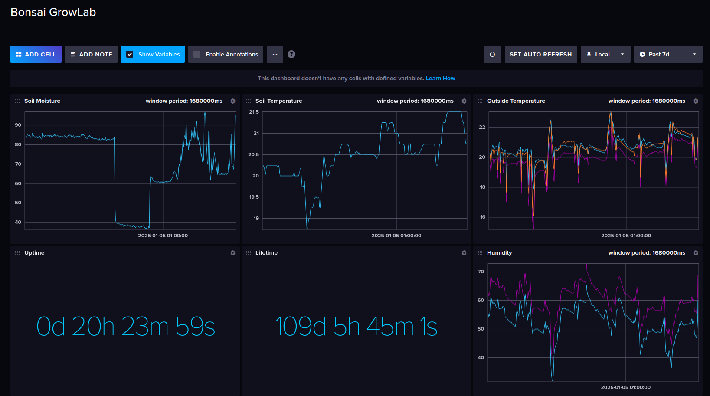

## Introduction

This guide shows how to set up the device-hub on the Raspberry Pi and monitor data from the IoT devices using the InfluxDB database.

## Install Raspberry Pi OS

Install the Raspberry Pi OS using the [Raspberry Pi Imager](https://www.raspberrypi.com/software/). It's possible to use any Linux-based operating system, see the [Getting Started Guide](https://www.raspberrypi.com/documentation/computers/getting-started.html). The following instructions use Raspberry Pi OS Lite 64-bit. During the installation, make sure that SSH is enabled and the "Allow public-key authentication only" option is set. This will be needed later to set up the system. Next, make sure the wireless LAN is configured with the router's SSID and password, or it can be skipped if the Ethernet connection is to be used. Once the operating system has been installed, you'll need to connect to the RPi to perform the necessary settings.

For the RPi 4 it's recommended to update the bootloader right after the OS is installed. This can be done with the following command:

```bash
sudo rpi-eeprom-update
sudo reboot
```

Once the OS is installed, switch on the RPi and check that mDNS is working properly:

```bash
# Replace `device-hub-rpi` with configured hostname.
ping device-hub-rpi.local
```

The result can be as follows:

```
64 bytes from 192.168.1.169 (192.168.1.169): icmp_seq=1 ttl=64 time=8.86 ms
64 bytes from 192.168.1.169 (192.168.1.169): icmp_seq=2 ttl=64 time=8.50 ms
64 bytes from 192.168.1.169 (192.168.1.169): icmp_seq=3 ttl=64 time=12.4 ms
```

For some reason my RPi won't boot unless I connect it to the external display. The first time it is connected to the display, it boots normally and I can continue to use it without any problems.

If the RPi is working normally, it's time to connect to it via SSH and set up the device-hub.

## Install System Software

During the OS installation it was required to enable SSH. Now it's time to add a private key to the ssh agent, so that it will be possible to connect to the RPi without manually specifying the path to the private key:

```bash
# Replace with the corresponding path to the private SSH key.
ssh-add ~/.ssh/rpi3b
```

Now it should be possible to connect to the RPi as follows:

```bash
# Replace dshil with the configured user name
# Replace device-hub-rpi with the configured hostname
ssh dshil@device-hub-rpi.local
```

Now it's time to install the required packages.

**Install Docker**

```bash
for pkg in docker.io docker-doc docker-compose podman-docker containerd runc; do sudo apt-get remove $pkg; done

# Add Docker's official GPG key:
sudo apt-get update
sudo apt-get install ca-certificates curl
sudo install -m 0755 -d /etc/apt/keyrings
sudo curl -fsSL https://download.docker.com/linux/debian/gpg -o /etc/apt/keyrings/docker.asc
sudo chmod a+r /etc/apt/keyrings/docker.asc

# Add the repository to Apt sources:
echo \
  "deb [arch=$(dpkg --print-architecture) signed-by=/etc/apt/keyrings/docker.asc] https://download.docker.com/linux/debian \
  $(. /etc/os-release && echo "$VERSION_CODENAME") stable" | \
  sudo tee /etc/apt/sources.list.d/docker.list > /dev/null
sudo apt-get update

sudo apt-get install docker-ce docker-ce-cli containerd.io docker-buildx-plugin docker-compose-plugin
```

**Install git**

```bash
sudo apt-get install git
```

## Install Device-Hub Software

**Clone device-hub repository**

```bash
git clone https://github.com/open-control-systems/device-hub.git
```

**Run influxdb service**

```bash
# Replace <username>, <password>, <admin>, <bucket>, <org> with the required credentials.
# See also https://docs.influxdata.com/influxdb/cloud/reference/key-concepts/data-elements/.
cd device-hub/projects/main
INFLUXDB_USERNAME="<username>" \
INFLUXDB_PASSWORD="<password>" \
INFLUXDB_ADMIN_TOKEN="<admin_token>" \
INFLUXDB_BUCKET="<bucket>" \
INFLUXDB_ORG="<org>" \
docker compose up influxdb -d
```

**Verify influxdb service**

Use ssh port forwarding to access influxdb on the local PC.

```bash
# 8086 - local PC port.
# localhost:8086 - target RPi port.
ssh -L 8086:localhost:8086 dshil@device-hub-rpi.local
```

Once the port forwarding is enabled, go to `localhost:8086` in the web-browser, and enter the influxdb credentials, that were last used to run the docker compose service.

**Determine influxdb `org` identifier**

It will be used later to create API tokens for the device-hub.

```bash
curl http://localhost:8086/api/v2/orgs -H "Authorization: Token <admin_token>"
```

**Retrieve influxdb API token**

It's an access token for the device-hub.

```bash
# See also: https://docs.influxdata.com/influxdb/cloud/admin/tokens/create-token/
curl http://localhost:8086/api/v2/authorizations \
  -H "Authorization: Token <admin_token>" \
  -H 'Content-type: application/json' \
  --data '{
  "status": "active",
  "description": "device-hub API token",
  "orgId": "<orgId>",
  "permissions": [
    {
      "action": "write",
      "resource": {
        "type": "buckets"
      }
    }
  ]
}'
```

Save "token" field for later usage.

**Run device-hub**

```bash
cd device-hub/projects/main

# Create log directory.
sudo mkdir -p /var/log/device-hub

# Build the container.
docker compose build device-hub

# Run the service.
INFLUXDB_API_TOKEN="<api_token>" \
INFLUXDB_BUCKET="<bucket>" \
INFLUXDB_ORG="<org>" \
DEVICE_HUB_LOG_PATH="/var/log/device-hub/app.log" \
DEVICE_HUB_API_BASE_URL="http://bonsai-growlab.local/api/v1" \
docker compose up device-hub -d
```

**Configure network**

The device-hub relies on the mDNS to receive data from the IoT devices. That's why it's required for the devices and the device-hub to be connected to the same WiFi AP. If you have any issues connecting RPi to the WiFi AP, make sure WiFi AP doesn't force WiFi STA to use [PMF](https://en.wikipedia.org/wiki/IEEE_802.11w-2009).

It's also required that the device implements the following HTTP endpoints:

```bash
# Receive telemetry data.
#
# Required fields
#  - timestamp - valid UNIX timestamp
http bonsai-growlab.local/api/v1/telemetry

# Receive registration data.
#
# Required fields
#  - timestamp - valid UNIX timestamp
#  - device_id - unique device identifier, to distinguish one device from another.
http bonsai-growlab.local/api/v1/registration
```

The following steps assume that [bonsai firmware](https://github.com/open-control-systems/bonsai-firmware) is installed on the device. Due to specific `bonsai-firmware` settings it's necessary for the device-hub to connect to the `bonsai-firmware` WiFi AP to ensure that device-hub can get the data from the device.

```bash
# Scan the network for the corresponding device's AP.
sudo nmcli device wifi rescan
nmcli device wifi list

# Connect to the device's AP.
sudo nmcli device wifi connect "bonsai-growlab-369C92005E9930A1D" password "bonsai-growlab-369C920"
```

**Monitor device data in influxdb**

Open `locahost:8080` in a browser and enter the influxdb credentials. Ensure SSH port forwarding is enabled. Navigate to the Data Explorer, select the required data type, telemetry or registration, then select the device ID. It's also possible to explore the data using the pre-configured dashboards. See the example below.


